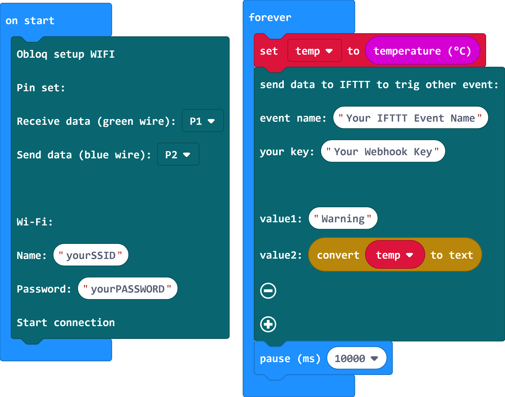

# Obloq_http

這是專為micro:bit提供的DFRobot Obloq積木\
This is the HTTP blocks for DFRobot Obloq

## Author
Liou Zheng-Ji\
劉正吉\
[my page, https://sites.google.com/jes.mlc.edu.tw/ljj/](https://sites.google.com/jes.mlc.edu.tw/ljj/)

## Description
1.Weather\
The micro:bit extension is for DFRobot OBLOQ WIFI module to inquire the weather information of the cities around the world from the OpenWeather website.\
[DFRobot Obloq here, https://www.dfrobot.com/product-1674.html](https://www.dfrobot.com/product-1674.html)\
If you want to use the extension, at first, you have to regiser an account from OpenWeather to get a key to access the weather information.\
[the OpenWeather website here, https://openweathermap.org/](https://openweathermap.org/)\
 \
2.ThingSpeak\
The ThingSpeak block can let you send the data from sensors to the ThingSpeak to let you analyze the huge data you collect by micro:bit.\n
At first, you have to regiser an account, and create a channel to get a write key to access your data channel.
[the ThingSpeak website here, https://thingspeak.com/](https://thingspeak.com/)\
 \
3.IFTTT\
The IFTTT block can let you send the data from sensors to the IFTTT to trig the Line Notify to inform you that something is happened.\n
At first, you have to regiser an account, set a webhook event to trig a Line Notify service in IFTTT. You have to get an event name and a key before you use the IFTTT block.
[the IFTTT website here, https://ifttt.com/](https://ifttt.com/)

## Example1: How to get the weather information
Press A to inquire the current temperature for Taipei in Taiwan.\
Press B to inquire the current humidity for the city that city ID is 1668341(as the same, Taipei)\
You can get the city ID from the file to search your own city. Download the file and extract it to find your city ID.\
[Download from http://bulk.openweathermap.org/sample/city.list.json.gz to get city ID](http://bulk.openweathermap.org/sample/city.list.json.gz)\


## Video1: Weather Information
[](https://www.youtube.com/watch?v=SMbRdlF9AEA)

## Example2: Send data to ThingSpeak
When you power on the micro:bit attached OBLOQ WIFI module, the micro:bit will send temperature and light level data to ThingSpeak every 16 seconds. The ThingSpeak allow you to send data to it every 15 seconds one time, so the pause time do not less than 15 seconds.\
If you want the detail description, please visit my website:\
[https://sites.google.com/jes.mlc.edu.tw/ljj/microbit開發板/microbit積木/thingspeak資料儲存積木](https://sites.google.com/jes.mlc.edu.tw/ljj/microbit開發板/microbit積木/thingspeak資料儲存積木)\


## Video2: Send data to ThingSpeak
[](https://www.youtube.com/watch?v=bQTu6bFurEA)

## Example3: Send data to IFTTT
When you power on the micro:bit attached OBLOQ WIFI module, if the temperature more than 35 degrees Celsius, the micro:bit will send data to IFTTT to trig the Line Notify to you.\
If you want the detail description, please visit my website:\
[https://sites.google.com/jes.mlc.edu.tw/ljj/microbit開發板/microbit積木/ifttt積木](https://sites.google.com/jes.mlc.edu.tw/ljj/microbit開發板/microbit積木/ifttt積木)\


## Video3: Send data to IFTTT
[](https://www.youtube.com/watch?v=9CXRKH8INck)

## License

* MIT

## Supported targets

* for PXT/microbit
(The metadata above is needed for package search.)

```package
Obloq_http=github:lioujj/pxt-Obloq_http
```